# flutter_dojo

  

Dojo，源自日语「道場」。

flutter_dojo项目的主要目的是为了帮助Flutter初学者快速入门Flutter开发，并借助该项目快速建立起Flutter的知识体系架构。

flutter_dojo主要分为下面几个部分：Widgets、UI Pattern、Develop UI Kit、Animations、Back-end Util。

体验Apk下载：

[Github Actions APK download](https://github.com/xuyisheng/flutter_dojo/releases)

## 设计思路

flutter_dojo的设计主要围绕下面三个部分展开：

- 良好的演示效果
- 简单明了的代码
- 好看的界面设计

整个项目的代码都以上面几点作为目标，代码力图简洁，不使用复杂的架构设计和抽象，每一部分的演示代码几乎都可以单独使用，同时尽可能的美化UI。

### Widgets

Widgets部分的设计思路是为了演示Flutter中茫茫多的Widget的具体使用场景和功能，虽然只使用Flutter提供的一些基本Widget，已经可以实现大部分的界面、功能开发，但是，了解更多的Widget，可以让开发者的开发思路更广，使用更加合适的Widget来完成合适的开发场景。

### UI Pattern

UI Pattern部分的设计思路是为了帮助开发者了解如何使用Flutter来拆分大部分APP中的界面模板，通过Flutter实现一个个UI组件，来组合成完整的Flutter界面。

### Develop UI Kit

Develop UI Kit部分的设计思路是为了帮助开发者掌握Flutter中的一些常用的工具类的使用，让开发者了解Flutter的布局、测量以及常用的UI工具，为更好的使用Flutter组件打好基础。

### Animations

Animations部分的设计思路是为了让开发者对Flutter的动画有一个完整的认识，针对不同的场景使用不同的动画方案，同时，对大部分常见的动画场景进行梳理，完成动画场景的归类。

### Back-end Util

Back-end Util这部分主要是针对Flutter中的非UI场景知识点进行的梳理，包括数据持久化、解析、状态管理等等。

### 展示界面

所有的展示界面，都以演示效果为目的，展示该Widget最主要的属性，并通过实例演示更改属性后的效果，举例如下。

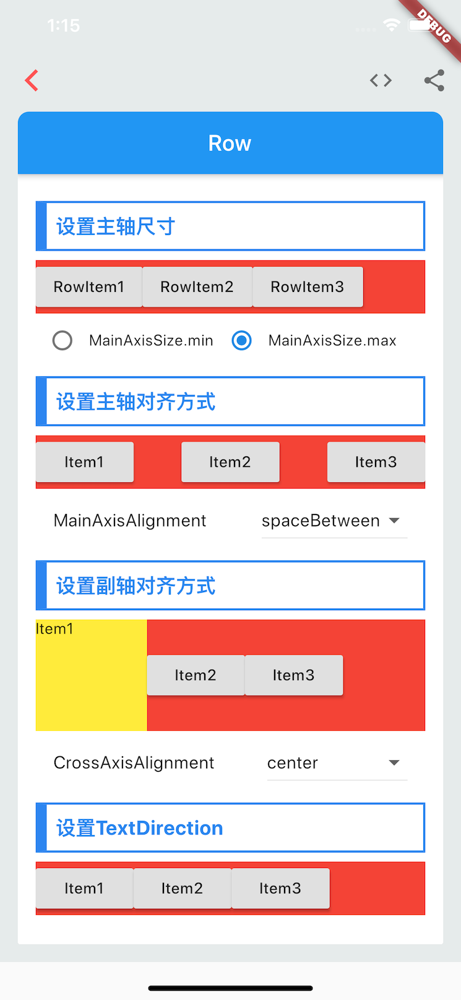

修改对应的属性后，可以直接展示修改效果，从而了解到该属性的作用。

同时，Demo代码可以直接查看。

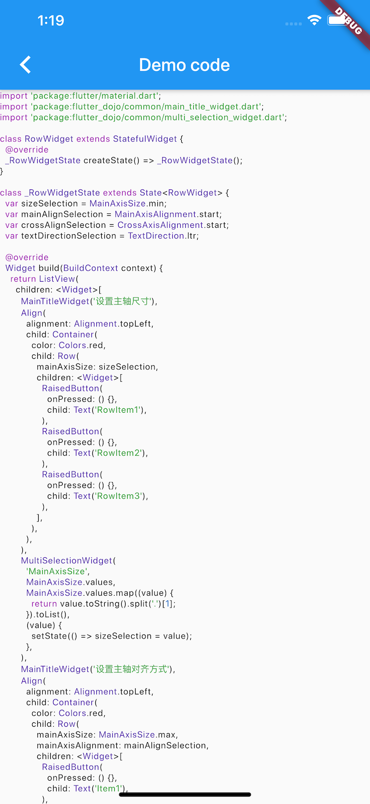

而且代码也可以直接分享出来，分享出来的代码几乎是可以直接Copy使用的代码。

## Widgets

Widgets部分包含了Flutter官方Category中的几乎所有Widget，是的你没看错，按照官网的Category划分，穷举了官方列出的所有Widget，同时也新增了一些未出现在Category中，但却很常用的Widget。

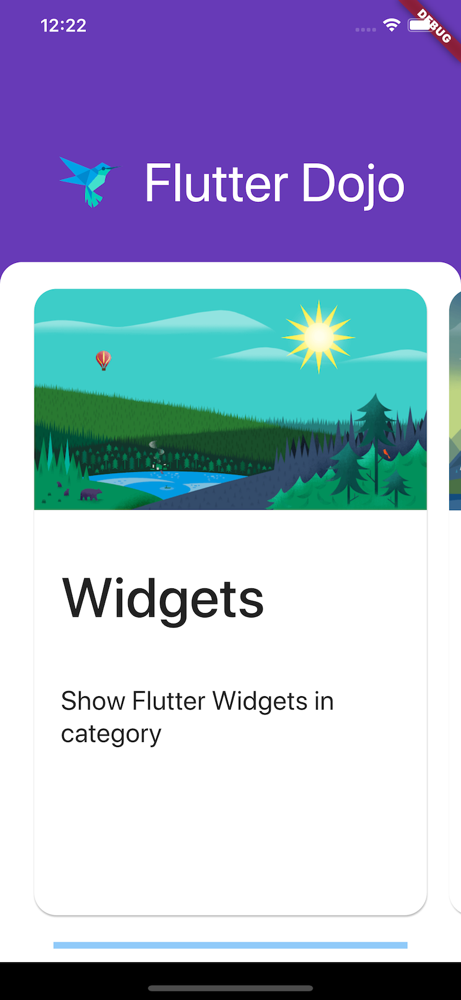

在每个Category中，都按照A-Z的顺序展示Widget。

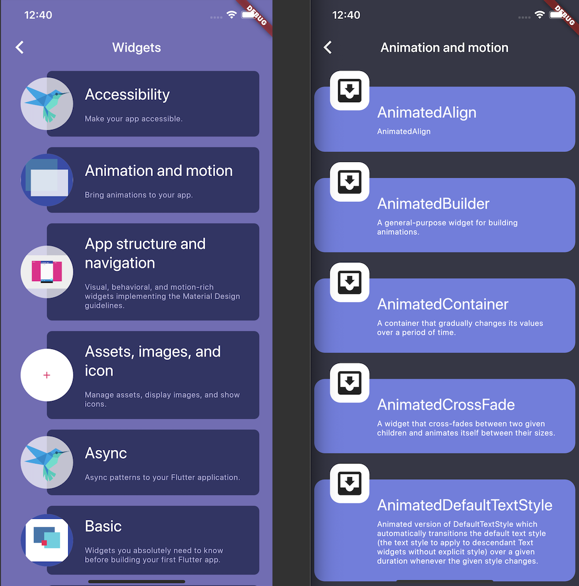

## UI Pattern

UI Pattern部分包含了APP中常用的界面开发模板元素，例如APPBar、Banner、Login、Setting等等，在UI Pattern中，开发者可以找到各自分解的UI元素，了解如何使用Flutter来构建这些UI组件。

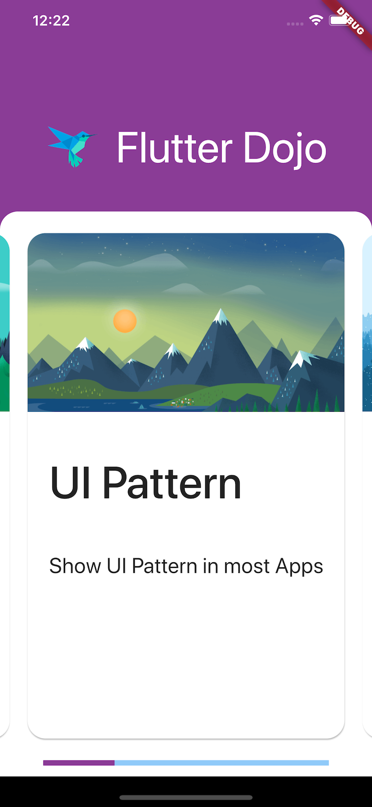

在UI Pattern中，我分类列举了很多不同的模板类型。

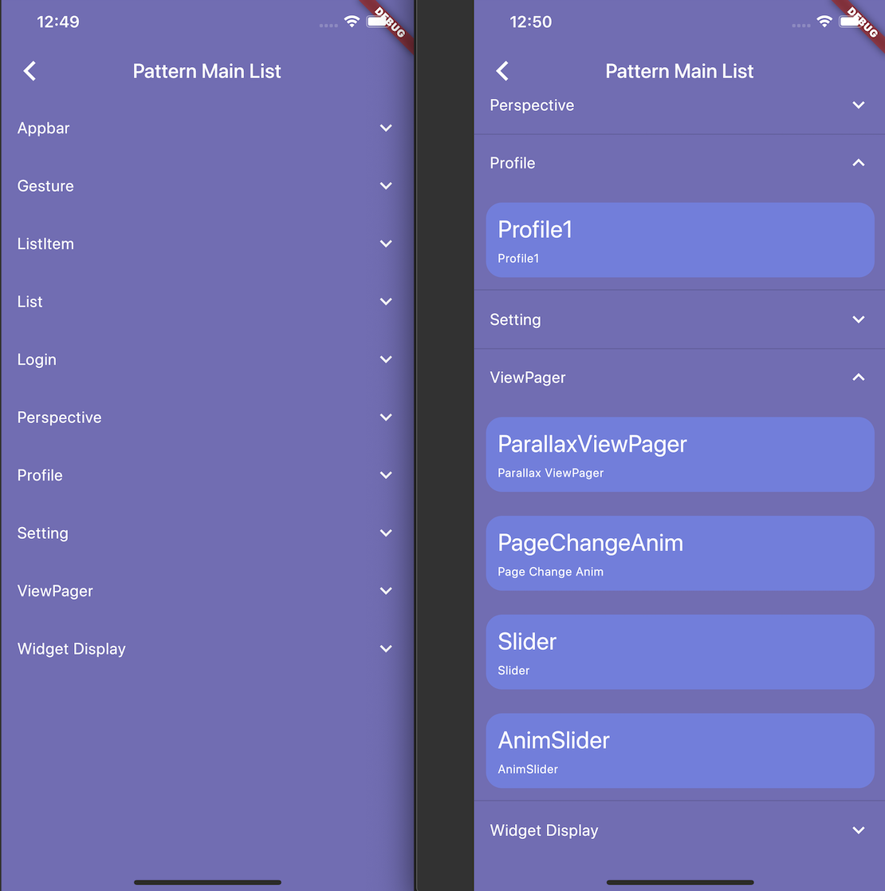

## Develop UI Kit

Develop UI Kit列举了UI开发中的一些常用工具类和开发模板代码，开发者可以使用这些工具类来完成一些UI功能开发。

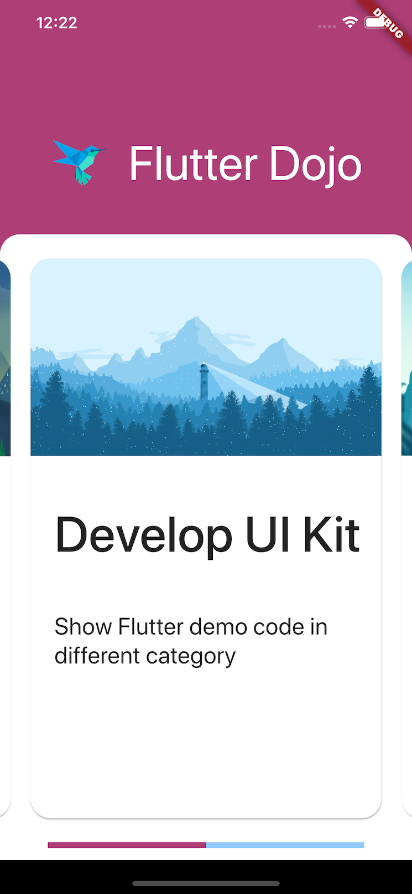

在Develop UI Kit中，按照A-Z对相关代码进行了排列。

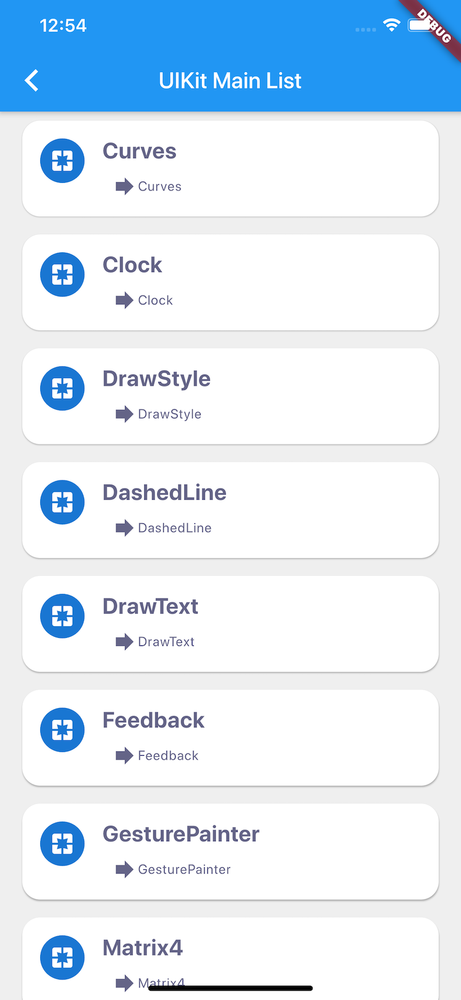

## Animations

由于动画在APP开发中的重要性，这里特地将Animations作为一项单独列出。开发者可以在这里找到不同的Animation开发模式，了解不同的Animation使用方法。

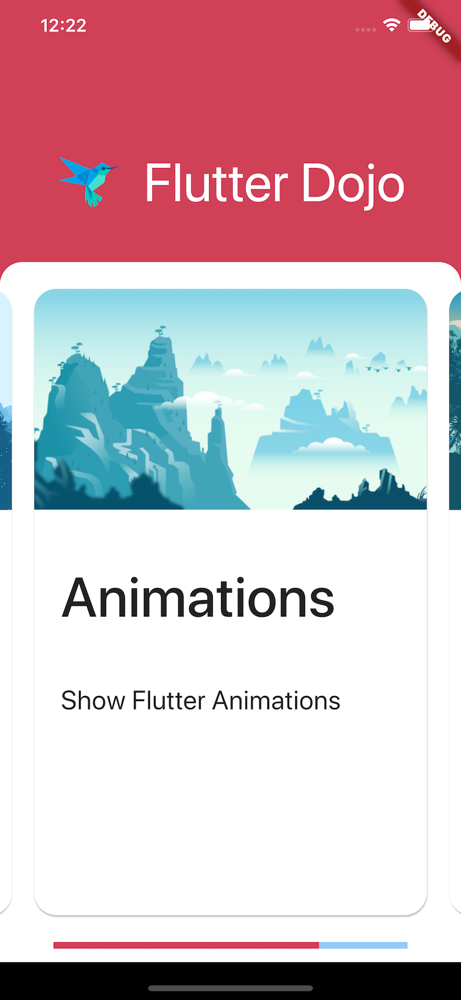

在Animations中，同样是根据不同的功能进行了划分。

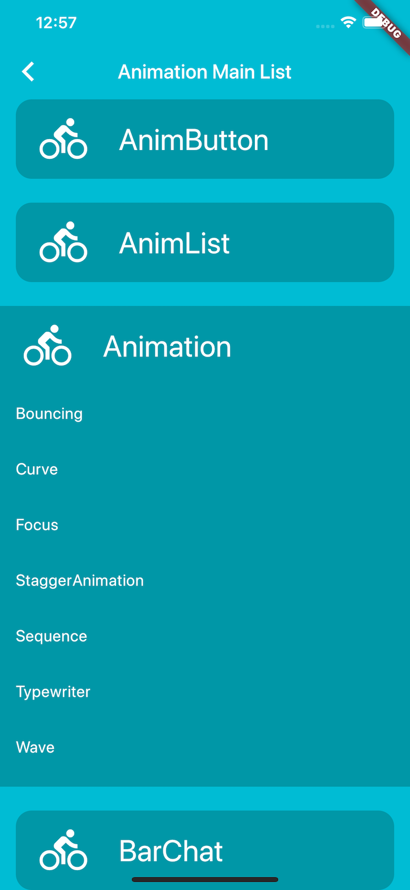

## Back-end Util

Back-end Util中列举了非UI的一些Flutter知识点。

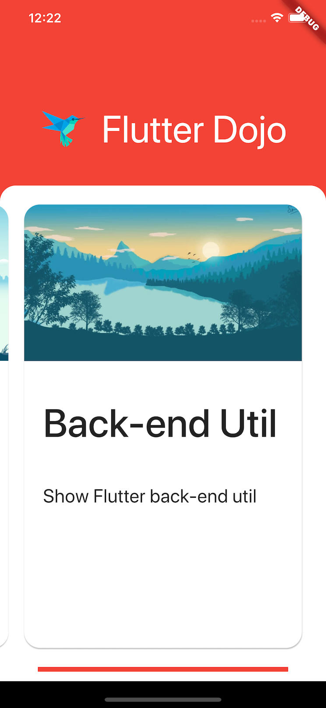

Flutter不仅仅是一个UI跨平台框架，同样是一个完整的APP开发框架，所以，这里列举了除了UI开发之外的一些功能。

## 协作

虽然该项目已基本成型，但很多内容还需要进一步的完善，特别是归纳部分，有很多地方还是很不完善的，甚至有一些代码还未实现，需要进一步优化和实现。

因此，欢迎大家提交PR，希望大家按照模板代码提交，一起完善这个项目。

有兴趣一起协作的开发者可以添加我的微信。

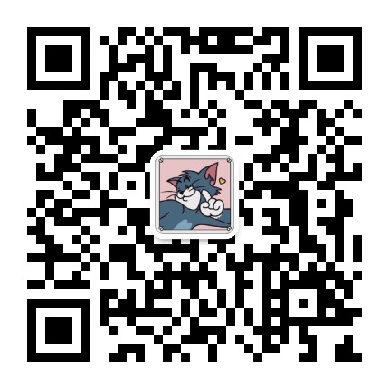

或者感兴趣的开发者可以加入我的Flutter修仙群，加我微信我拉你进群。

## 打赏

